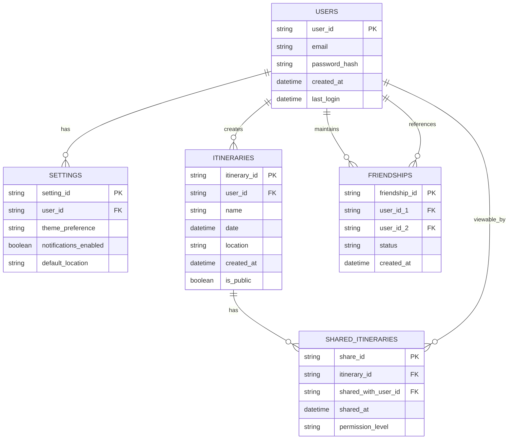

# Project Name: NightOut (Working Title)

## Project Overview
Plan a night out by entering a location (zipcode, gps location) to find points of interests around the user to create an itinerary. Share your plans with friends and discover their itineraries.

## Goals
- Create engaging and personalized night out experiences
- Enable social sharing of itineraries
- Simplify night out planning process

## Features
### Must-Have
- [ ] Find locations around users by type
- [ ] Create a route based on filter requirements (price, distance, open times) and title them
- [ ] Send routes to navigation app
- [ ] Add and manage friends
- [ ] Share itineraries with friends
- [] View friends' public itineraries

### Nice-to-Have
- [ ] Collaborative itinerary editing
- [ ] Friend activity feed

## Sprints
1. Sprint 1 
    - User authentication and profiles
    - Location search and filtering

2. Sprint 2 
    - Route locations together
    - Location cards to view info about Locations

3. Sprint 3
    - Share route/itineraries

## Stories

## Tech Stack
- Frontend: 
- Backend: 
- Database: 

## Database Relationships

